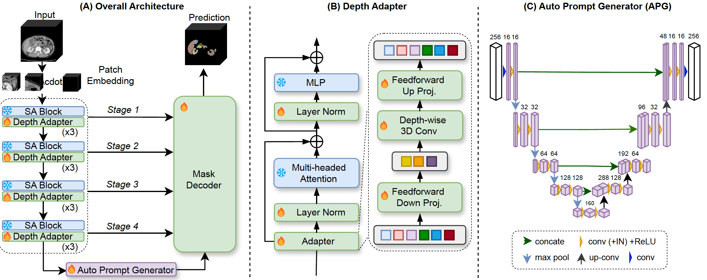

# AutoProSAM
AutoProSAM: Automated Prompting SAM for 3D Multi-Organ Segmentation

## Data Preprocessing
- Please follow [this reference](https://github.com/yhygao/CBIM-Medical-Image-Segmentation) regarding your original datasets for conversion, such as operations for resampling, cropping, and padding.
## For Training and Testing 
- For additional baseline models, please refer to [this link](https://github.com/yhygao/CBIM-Medical-Image-Segmentation).
## Contact
- Chengyin Li, cyli@wayne.edu
